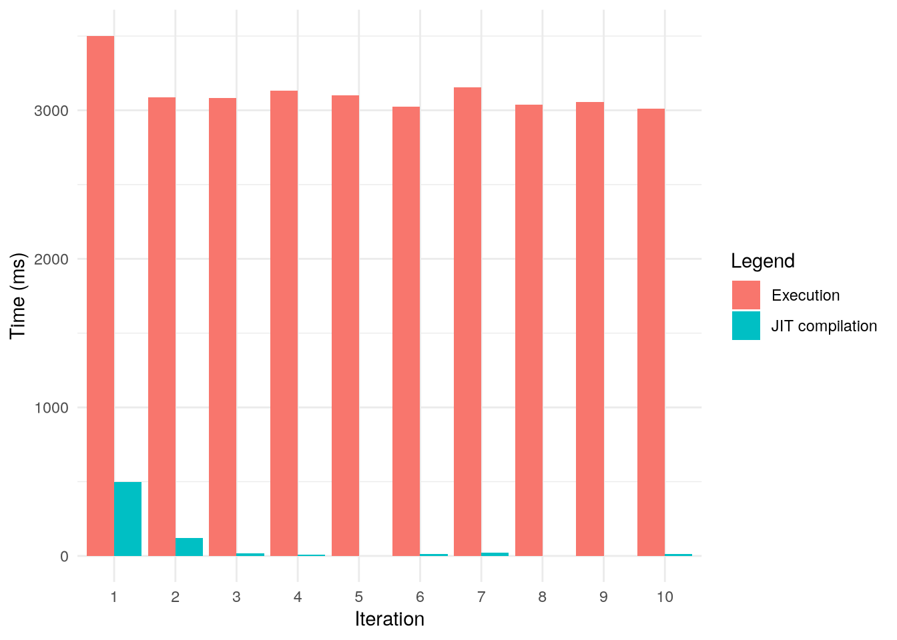
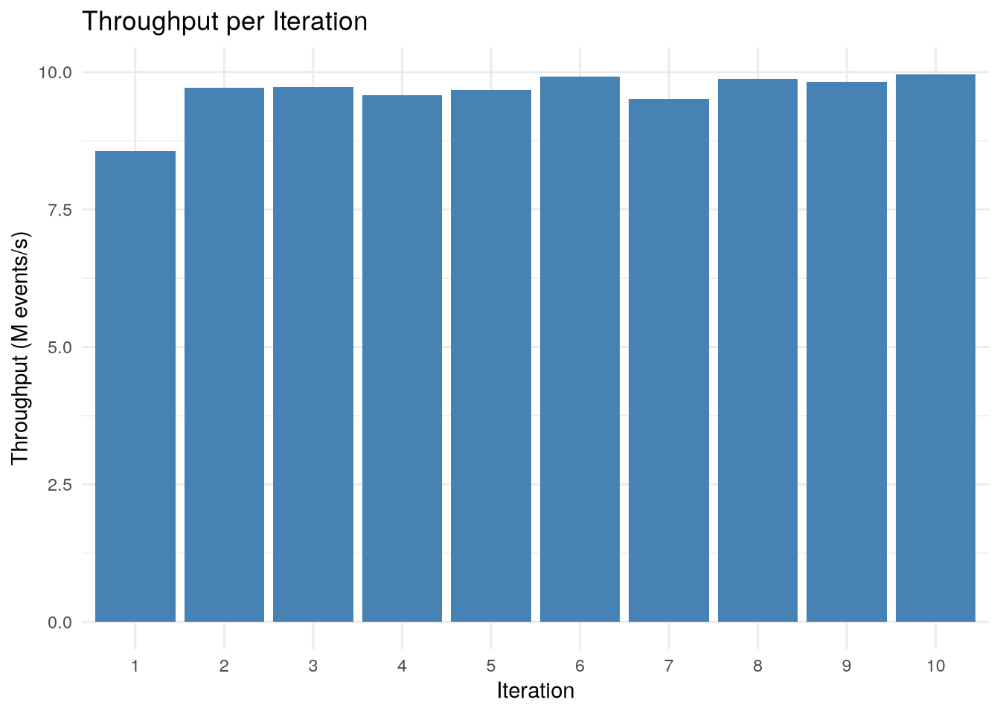

# LMAX Disruptor multiproducer data processing pipeline

### Data model and workload

#### TelemetryEvent

At the beginning of the pipeline, the Event is only a partial event, containing only one of the data fields. Upon receiving all fields for an instance of ObservationID inside the `AssemblerHandler`, the final full TelemetryEvent is composed and used in the rest of the pipeline.

- `observationId: long` - identifier of a logical moment in time of the given observation - is shared between partial
  events and used as an assembling key
- `dataSourceID: long` - works as an abstraction over the identifier of the source device, the currently running job and
  the line number at which the controller was executing the job at the time of the observation.
- `torques: double[6]` - represents the observed torque for each axis of the robot
- `temperatures: double[6]` - represents the observed temperature for each axis of the robot

### Data pipeline

The easiest explanation is the code of the nice LMAX Disruptor API:

```java
// first the produced partial events are assembled into complete tuples of all data
disruptor.handleEventsWith(new AssemblerHandler(ringSize))
        // then anomaly detection
        .then(new AnomalyDetectorHandler())
        .then(
            // then parallel anomalies processing
            new AnomalyPersistenceHandler(detectedFailingDataSources),
            // and data sampler of all events to simulate external out of pipeline storage/processing
            new DataSampleHandler(sampleStore, totalProcessedEventCount));
```

Each of these pipeline stages (or Handlers as Disruptor calls them) are running in its own separate thread created by the `DaemonThreadFactory` JDK thread factory, which is specified in the Disruptor constructor.

- `TelemetryProducer` serves as a producer of data in its own thread. Each producer produces `TelemetryEvent`s containing either one of `DataSourceID`, `torques` or `temperatures`.
    - The `producer_threads` parameter controls the number of concurrent producer threads. The `events_per_producer` parameter controls the number of events per producer thread.
    - Each data point is identified with a specific ObservationID. For simplification, it is guaranteed that each ObservationID will eventually produce all DataSourceID, torques and temperatures. But the `AssemblerHandler` can handle situations where the the partial event is never finished in a certain amount of time without memory leaks.
    - A randomized wait of several tens of nanoseconds is performed before claiming a sequence from the RingBuffer to simulate real-world producer workload and likely reduces contention by a bit.
- `AssemblerHandler` holds a stateful map of incoming partial events and publishes the full event to the next handler
  only once all three pieces for the given observation id arrive.
- `AnomalyDetectorHandler` calculates a Rolling RMS for each DataSourceID observed. If the value crosses a 1.3x
  threshold from the baseline, it tags the event as an anomaly.
- `AnomalyPersistenceHandler` reads events tagged as anomalies and stores them for validation.
- `DataSampleHandler` samples every 100 events received and stores them into a preallocated off-heap buffer to simulate
  external storage without influencing GC.

### Design choices

The Disruptor programming model was chosen due to its relative uniqueness in focus on lock-free pipeline processsing with a very impressive throughput for pipelines with multiple producers and consumers. The current concurrent workloads in the Renaissance suite focused on the Actor model (akka and reactor) or JDK task based concurrency. A workload which works in "mechanical sympathy" (as the authors of Disruptor like to say) was missing.

For the specific strategies of the Disruptor model I chose `BusySpinWaitStrategy`, because this maximizes throughput at the cost of some busy spinning upon contention. It is generally appropriate to use for scenarious where, predictable latency is prefered. This specific pipeline is very CPU bound and has a continuous data-flow, therefore the threads dont busy spin for very long (although IntelliJ Profiler tells me, that its one of the hotspots - which makes sense, given there is a lot of events being produced...).

All random number generators use the same seed for every run, therefore each iteration should result in roughly equal workload. I used a simplified thread unsafe PRNG `FastUnsafeRandom`, because the thread safe variant `java.util.Random` was one of the bottlenecks in the producer threads.

I also tuned the assembly of partial events inside `AssemblerHandler`, because the usage of a fast hashmap was still very expensive and in a production scenario did not really make sense, since it would create memory leaks of unfinished partial events. I used a preallocated buffer which is sized based on the expected throughput and desired lifetime of a partial event. It assumes that the keys are incremented linearly and therefore older values will be overwritten by new ones once the array wraps around.

Overall the random and assembly tuning resulted in doubling of throughput (to ~9M events/s) at the expense of ~1GB of memory (outside of JVM heap).

#### Licensing

The LMAX Disruptor and Aeron agrona (optimized containters and utilities), whose libraries I used in the workload are licensed under Apache 2.0 license and the workload is also licensed under the same license.

#### Workload scaling

- `events_per_producer` - Number of partial events to produce per producer thread (default 5,000,000).
- `producer_threads` - Number of concurrent producer threads (default 6).
- `expected_throughput` - The expected throughput of the pipeline. This depends on the hardware on which it is run. Not easy to guess, but an optimistic guess of 10M events/sec for a less than 10 years old CPU seems to work fine.
- `ring_size` - Size of the Disruptor ring buffer. Should be a power of 2, for optimal performance.
    - Making it smaller results in more backpressure for the producers and forces a slowdown.
### Validation

The validation is rather simple, it validates that all produced events go through the whole pipeline.
It also validates that the anomalous data sources are marked as such and that the number of sampled full events at the end is exactly as expected and are properly stored.

### Preliminary results from local run

I used the `jmx-timers` plugin which adds the JIT compilation times information to the results. I ran the benchmark with the JMX-timers plugin like this.

```bash
java -jar <renaissance-jar> \
  --plugin <jmx-timers-jar> \
  --csv results.csv \
  --json results.json \
  disruptor-telemetry
```

The result is stored in the [included](../../results.csv) [files](../../results.json).



From the results, we can see that the JIT compiler works hardest in the first iteration (497ms of the 3501ms total runtime) and then is still relatively significant for the several subsequent iterations. The total runtime after the first iteration is very stable at around either 3000-3100ms. I presume that the minor deviations can be attributed to side effects of other running tasks in the system and the fact that the ring buffer sequence acquiring lock-free CAS loops are a point of high contention, a wrong order can mess up the sequences inside the frame buffer. I played with the delay between producers for a bit to force the misordering of events and it resulted in large differences in throughtput (half runs ~12,5M vs half ~9M events/s). This surprised me, because the selling point of LMAX Disruptor was the stable latency - but the multi producer scenario will probably always be a bit trickier in this regard, due to it's sequence guarantees and high contention on the producers side.



The first run results in about ~8,5M events/second while the faster comes in at ~10M events/second. The JIT optimized code therefore results in about 15% speedup. I think that the speedup is rather modest due to the fact, that the LMAX Disruptor (and the workload itself) is designed with mechanical sympathy in mind, there is less low hanging fruit, which the JIT compiler can pick, which can explain the rather modest speedup.